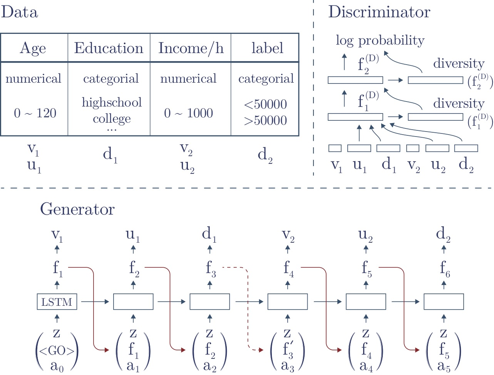
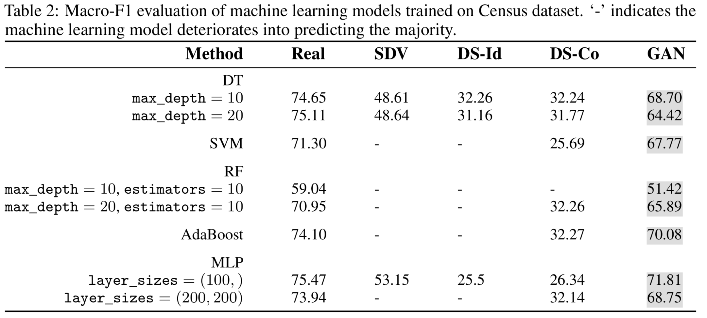
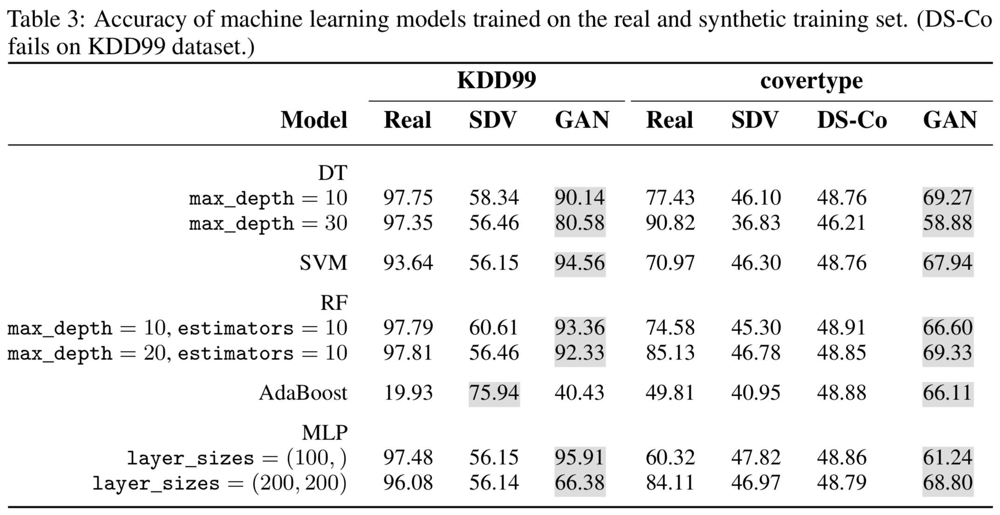

## Why do we need synthetic tabular data
More and more organizations rely on relational, tabular data to intelligently augment processes and workflows usually carried out by humans. According to a [recent survey](https://www.kaggle.com/surveys/2017) performed by Kaggle, it is the most commonly encountered data type in industry, and the second most commonly used format in academia.

However, people have concern about releasing data and create several barriers to using real data. Using synthetic data can alleviate a number of common data science concerns, including resolving critical bottlenecks, clearing bureaucratic hurdles and providing a "safe data space" for exploration. Synthetic data sets can be customized to fit specific needs, such as testing new tools or creating educational tutorials designed to imitate a particular type of problem. In addition, the use of synthetic data can eliminate unwanted contingencies when data is shared.

## GAN Synthetic Data Generator

### Model

<table>
<tr>
<td>
<ul>
<li>Apply reversible data transformation.</li>
<li>Use an LSTM generater to generate columns one by one.</li>
<li>Use an MLP discriminator to distinguish real data from synthetic data.</li>
</ul>
</td>
<td width="50%"></td>
</tr>
</table>


### Performance



## Copulas Synthetic Data Generator

## Citation

```
Lei Xu, Kalyan Veeramachaneni. 2018. Synthesizing Tabular Data using Generative Adversarial Networks.
@article{xu2018synthesizing,
  title={Synthesizing Tabular Data using Generative Adversarial Networks},
  author={Xu, Lei and Veeramachaneni, Kalyan},
  journal={arXiv preprint arXiv:1811.11264},
  year={2018}
}
```
